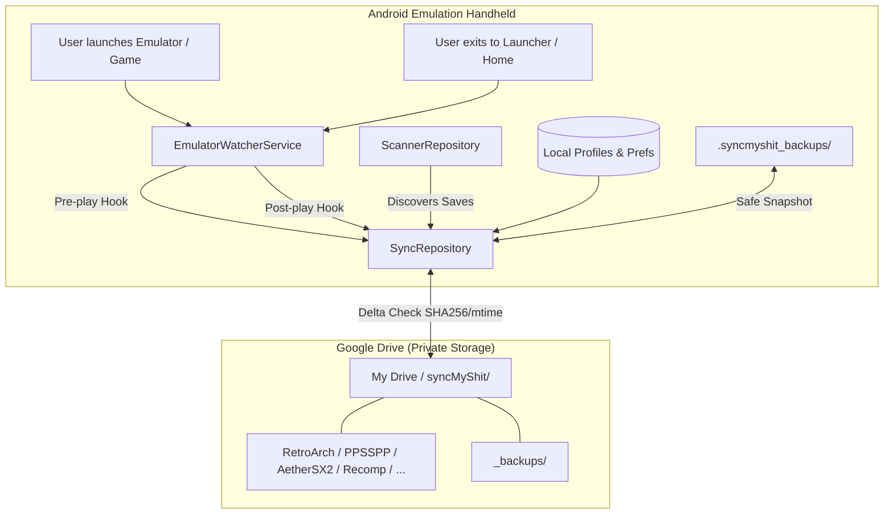

<div align="center">

# ☁️ syncMyShit
### Automagic Cloud Save Sync for Android Retro Emulation Handhelds

[](https://www.android.com/)
[](https://github.com/Kyss007/syncMyShit/releases/latest)
[](https://kotlinlang.org/)
[](https://developers.google.com/drive)
[-green.svg)](LICENSE)
[](LICENSE)

*Play on your Odin 2 on the couch, pick right back up on your Retroid Pocket on the train. Zero hassle. Zero save loss.*

---

### 📥 [Download Ready-to-Install APK](https://github.com/Kyss007/syncMyShit/releases/latest)
No compiling or developer knowledge required! Pre-built APKs are compiled automatically for every release:
- **[Download Latest APK from GitHub Releases](https://github.com/Kyss007/syncMyShit/releases/latest)** (Direct link to the `.apk` file)
- **[All Available Releases & Builds](https://github.com/Kyss007/syncMyShit/releases)**
- **Installation**: Download the `.apk` directly to your Android device, tap it to install (allow *"Install unknown apps"* if prompted), and follow the 3-step setup wizard!

---

</div>

## 💡 The Problem
Retro gaming on Android handhelds (AYN Odin, Retroid Pocket, Anbernic, Logitech G Cloud) is incredible, but keeping save files synchronized between devices or backed up safely is a nightmare:
- Every emulator stores saves in completely different folders (`/RetroArch/saves`, `Android/data/...`, `/PSP/SAVEDATA`).
- Native decompilations and recomp projects (Zelda 64 Recompiled, Ship of Harkinian, SM64) have their own separate directory structures.
- You shouldn't have to manually open an app, press upload, and remember which device has the newest save before you launch a game.

## 🚀 The Solution: syncMyShit
**syncMyShit** makes cloud synchronization **completely automagic**:
1. **Connect your Google Drive once** during the 3-step setup wizard.
2. **Auto-discovers** all your installed emulators, recomps, standalone games, and save directories across internal storage and MicroSD cards.
3. **Pre-Play Pull**: When you launch a game, it detects the app opening and automatically downloads any newer saves from Google Drive before you play.
4. **Post-Play Push**: When you exit the game back to your launcher (Daijishou, Beacon, ES-DE, or Home), it detects the exit and instantly backs up your new saves to Google Drive in the background.

---

## ✨ Features

- 🪄 **True "Automagic" Background Sync**: Runs silently in the background. No manual tapping required.
- 🔓 **Full Scoped Storage Support (DraStic, Dolphin, AetherSX2)**:
  - Supports both **Storage Access Framework (SAF)** DocumentTree and **Shizuku** (rootless ADB).
  - Effortlessly syncs emulators that save inside restricted `Android/data/<package>/files/` folders on Android 11, 12, 13, and 14+ (including **DraStic**, **Dolphin**, **AetherSX2**, **Citra**, **Yuzu**, and **DuckStation**).
- 🆓 **100% Free & Unlicensed (Public Domain)**: Zero fees, zero subscriptions, no proprietary lock-in. You own everything.
- 🔍 **Pre-configured for 20+ Emulators & Recomps**:
  - **Multi-System**: RetroArch (Standard, 64-bit, 32-bit cores)
  - **PlayStation**: PPSSPP (PSP), AetherSX2 / NetherSX2 (PS2), DuckStation (PS1), Vita3K (PS Vita)
  - **Nintendo**: Dolphin MMJR/Official (GC/Wii), Citra / Lime3DS / Azahar (3DS), Yuzu / Suyu / Sudachi / Uzuy (Switch), Mupen64Plus FZ (N64), DraStic & MelonDS (NDS), Pizza Boy & MyBoy (GBA/GBC)
  - **Sega**: Flycast & Redream (Dreamcast/Naomi)
  - **Recomp Projects & Native Ports**: Zelda 64: Recompiled (MM & OoT), Ship of Harkinian (SoH), 2 Ship 2 Harkinian, SM64 (sm64ex), Perfect Dark Recomp, AM2R, Balatro Mobile, PortMaster saves.
- ➕ **Custom Save Directories**: Add any directory or standalone game with custom file extension filters (`.sav`, `.dat`, `.json`, `*`).
- 🎮 **Handheld-First Controller Navigation**: Optimized for D-Pads and physical buttons (A/B/X/Y) with glowing neon focus states and OLED dark mode.
- 🛡️ **Zero Save-Loss Guarantee**:
  - Uses timestamp and SHA-256 / MD5 hash comparison to ensure files are never blindly overwritten.
  - Automatically creates a timestamped snapshot in a local `.syncmyshit_backups/` folder and in Google Drive's `_backups/` folder before any file update.
- ☁️ **Dual Drive Authentication**:
  - Standard one-click Google Sign-In for standard devices.
  - Custom OAuth 2.0 Client ID input for de-Googled devices (LineageOS, GrapheneOS, or Chinese handheld firmwares without Play Protect).
- 📶 **Smart Connectivity**: Option to restrict syncing to Wi-Fi to preserve mobile hotspots.

---

## 🏗️ Architecture



---

## 📱 Device Compatibility

Tested and designed specifically for modern Android gaming handhelds:
- **AYN**: Odin, Odin 2, Odin 2 Mini, Odin Pro, Loki Zero
- **Retroid**: Pocket 4 / 4 Pro, Pocket 3 / 3+, Pocket 2S, Pocket Flip
- **Anbernic**: RG556, RG405M, RG405V, RG505, RG Cube
- **Logitech**: G Cloud
- **Razer**: Edge
- **AYANEO**: Pocket Air, Pocket S
- **Generic Android**: Any Android phone, tablet, or TV box running Android 8.0 through Android 14+

---

## 🚀 Quick Start (3-Minute Setup)

1. **Download & Install**: Grab the latest APK from the [Releases](https://github.com/Kyss007/syncMyShit/releases) tab.
2. **Follow the Setup Wizard**:
   - **Step 1 (Permissions)**: Grant **All Files Access** (to read/write save directories) and **Usage Access** (to detect when games open and close).
   - **Step 2 (Google Drive)**: Tap **Sign In with Google**.
   - **Step 3 (Discovery)**: The app will scan your device and show all discovered emulators and save files.
3. **Play!**
   - That's it! When you open an emulator, **syncMyShit** pulls the latest save from Google Drive. When you finish, it uploads your progress automatically.

---

## ⚙️ Google Drive Setup Options

For details on connecting Google Drive, using your own Google Cloud Console OAuth Client ID, or running on de-Googled handhelds, check out the [Google Drive Setup Guide](docs/GOOGLE_DRIVE_SETUP.md).

For a complete list of supported emulators, paths, and extensions, see the [Supported Emulators Guide](docs/SUPPORTED_EMULATORS.md).

For permissions details and troubleshooting Scoped Storage on Android 11–14+, see the [Permissions Guide](docs/PERMISSIONS_GUIDE.md).

---

## 🛠️ Building from Source

### Prerequisites
- JDK 17 (Java 17)
- Android SDK (API 34, Build Tools 34.0.0)
- Git

### Build Commands

```bash
# Clone the repository
git clone https://github.com/Kyss007/syncMyShit.git
cd syncMyShit

# Run unit tests
./gradlew test

# Build debug APK
./gradlew assembleDebug

# Output APK will be located at:
# app/build/outputs/apk/debug/app-debug.apk
```

---

## 🤝 Contributing

Contributions are warmly welcomed! If you'd like to add support for another emulator, source port, or handheld project:
1. Fork this repository.
2. Add your emulator configuration to [`EmulatorRegistry.kt`](app/src/main/java/com/syncmyshit/app/data/local/EmulatorRegistry.kt).
3. Submit a Pull Request!

---

## 📄 License

This project is licensed under the MIT License - see the [LICENSE](LICENSE) file for details.
